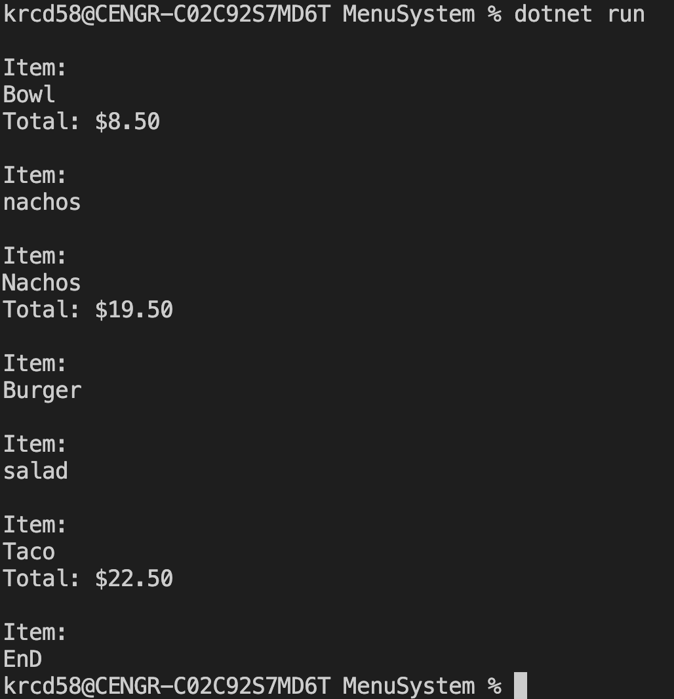

# MEnu Order Challenge
Create a program that prompts the user to input a menu item and calculate the total  for the order.

There is a restaurant which offers a menu of entrees, per the list of items and prices below. Imagine the following were entries in a dictionary:

    "Baja Taco": 4.00,
    "Burrito": 7.50,
    "Bowl": 8.50,
    "Nachos": 11.00,
    "Quesadilla": 8.50,
    "Super Burrito": 8.50,
    "Super Quesadilla": 9.50,
    "Taco": 3.00,
    "Tortilla Salad": 8.00

## Requirements

In a program called menu.py, implement a program that enables a user to place an order, prompting them for items, one per line, until the user types the word "end". After each inputted item, display the total cost of all items inputted thus far, prefixed with a dollar sign ($) and formatted to two decimal places.  Ignore any input that isn’t an item. You should create the menu as a dictionary.

- Prompt user for an item
- Display the total cost of all items inputted prefixed with a dollar sign ($) formatted to two decimal places
- Ignore any input that isn’t an item. The case will matter; for example "Taco" is a valid key but "taco" is not. So the user must enter the item as it is stored in the dictionary
- End the program when user types "end". Case should not matter. If the user types "end", "END", "End", "eND"...etc the program should still end.
- Create the menu as a dictionary.

Note: Your program should not crash for any reason. You should handle any exception(s) that may occur.

## Sample Output

