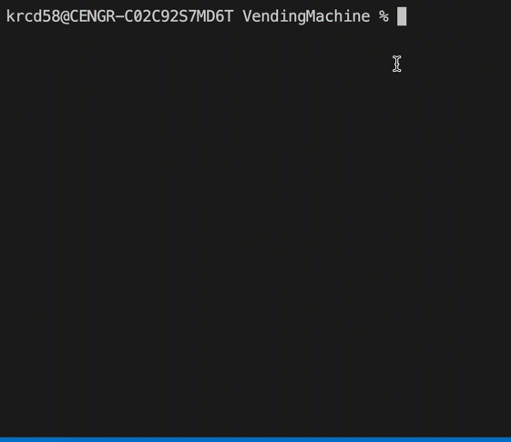

# Vending Machine Challenge

Create a program that prompts the user to insert a coin, one at a time, each time informing the user of the amount due. 

## Requirements

A vending machine sells snacks for 50 cents. In a project named vending_machine.py, implement a program that prompts the user to insert a coin, one at a time, each time informing the user of the amount due. Once the user has inputted at least 50 cents, output how many cents in change the user is owed. The user should only be able to input integers. Accepted denominations for coins are (1, 5, 10, 25). The program should ignore any integer that isn’t an accepted denomination.

- Display the amount due
- Prompt the user to enter a coin
- Accepted denominations for coins are (1, 5, 10, 25)
- Program should ignore any input that is not a valid input and re prompt the user to input a coin
- Process the input and display the updated amount due
- Once the user has inputted at least 50 cents, output how many cents in change the user is owed
- End program

Note: Your program should not crash for any reason. You should handle any exception(s) that may occur.

## Sample Output

