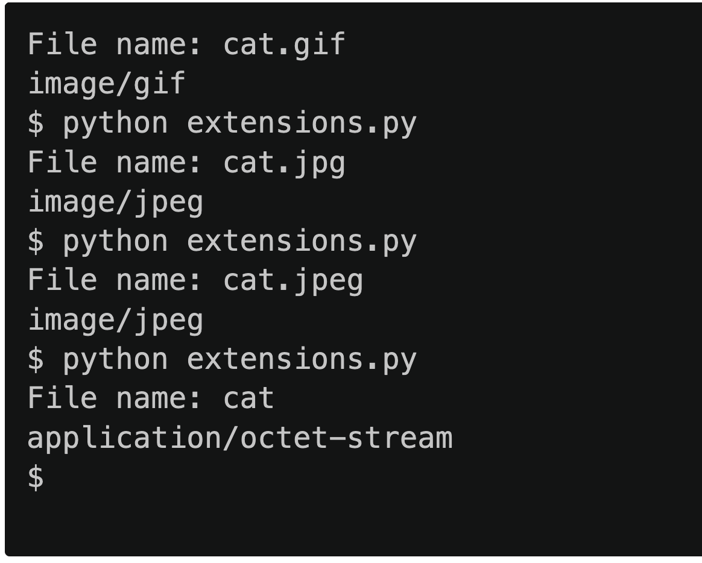

# File Types Challenge
Even though Windows and macOS sometimes hide them, most files have file extensions, a suffix that starts with a period (.) at the end of their name. For instance, file names for GIFs end with .gif, and file names for JPEGs end with .jpg or .jpeg. When you double-click on a file to open it, your computer uses its file extension to determine which program to launch.

Web browsers, by contrast, rely on media types, formerly known as MIME types, to determine how to display files that live on the web. When you download a file from a web server, that server sends an HTTP header, along with the file itself, indicating the file’s media type. For instance, the media type for a GIF is image/gif, and the media type for a JPEG is image/jpeg. To determine the media type for a file, a web server typically looks at the file’s extension, mapping one to the other.

See developer.mozilla.org/en-US/docs/Web/HTTP/Basics_of_HTTP/MIME_types/Common_types for common types.

In a file called extensions.py, implement a program that prompts the user for the name of a file and then outputs that file’s media type if the file’s name ends, case-insensitively, in any of these suffixes:

- .gif (image/gif)
- .jpg (image/jpg)
- .jpeg (image/jpeg)
- .png (image/png)
- .pdf (document/pdf)
- .txt (document/txt)
- .zip (file/zip)

If the file’s name ends with some other suffix or has no suffix at all, output ```application/octet-stream``` instead, which is a common default.

## Program Requirements
- Prompt the user to enter the filename with extenstion "File name: "
- Determine the file type
- Print the file type

## Sample Output


